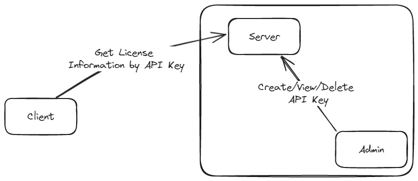

<h1 align="center">
    License key service
</h1>

<div align="center">
    
    
</div>

<br>



<!-- INSTALLATION -->
## Installation

#### Requirements:
- Rust
- Protobuf

#### Install Protobuf
````shell
choco install protoc
````

<!-- INFORMATION -->
## Information

This is a service for generating and validating license keys. <br>
The networking is done using gRPC. 

[client example](https://github.com/venotix/vlks/blob/main/examples/client/src/main.rs) <br>
[server example](https://github.com/venotix/vlks/blob/main/examples/server/src/main.rs)

<!-- ROADMAP -->
## Roadmap

See the [open issues](https://github.com/venotix/vlks/issues) for a list of proposed features (and known issues).


<!-- CONTRIBUTING -->
## Contributing

Contributions are what make the open source community such an amazing place to be learn, inspire, and create. Any contributions you make are **greatly appreciated**.

1. Fork the Project
2. Create your Feature Branch (`git checkout -b feature/AmazingFeature`)
3. Commit your Changes (`git commit -m 'Add some AmazingFeature'`)
4. Push to the Branch (`git push origin feature/AmazingFeature`)
5. Open a Pull Request
